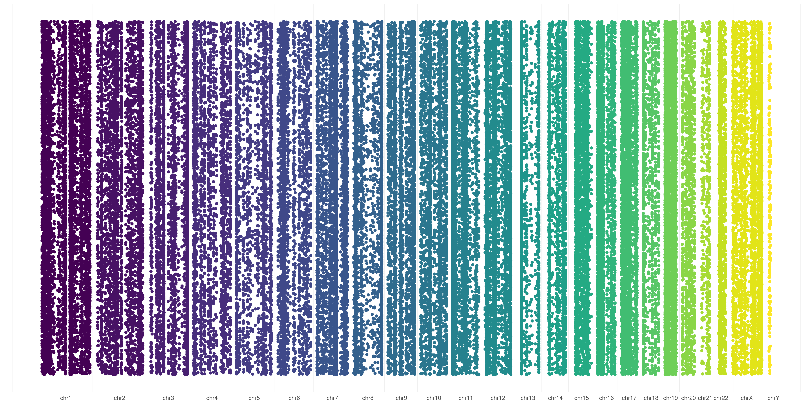
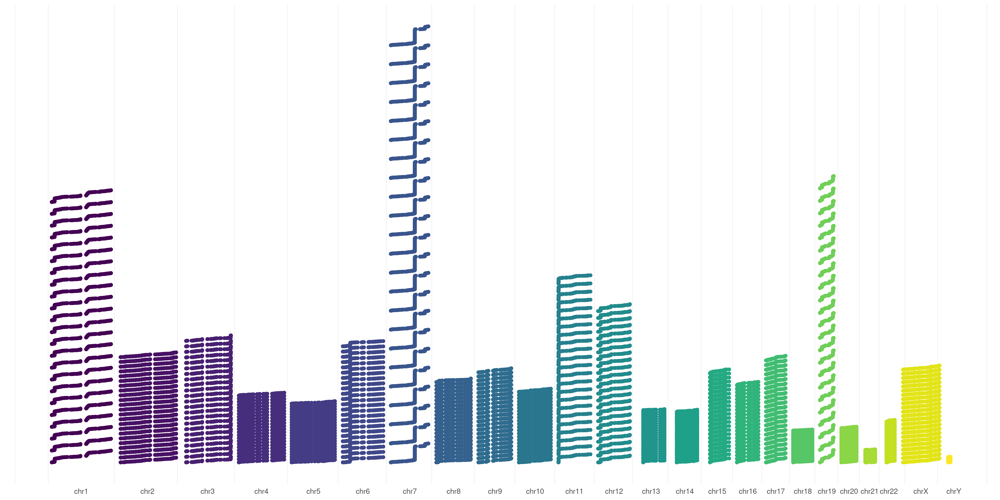
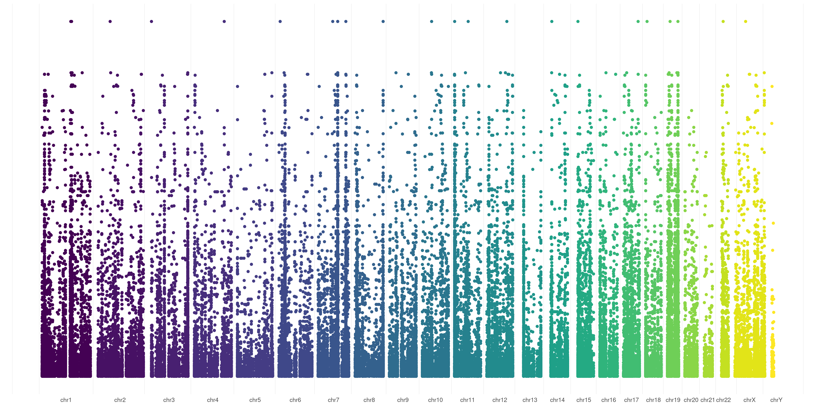
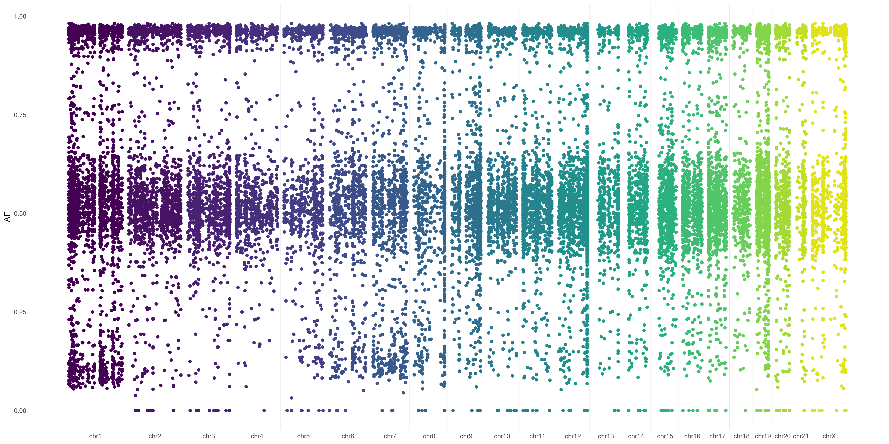
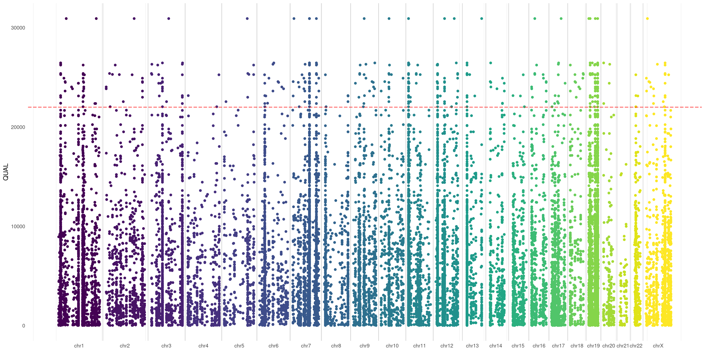
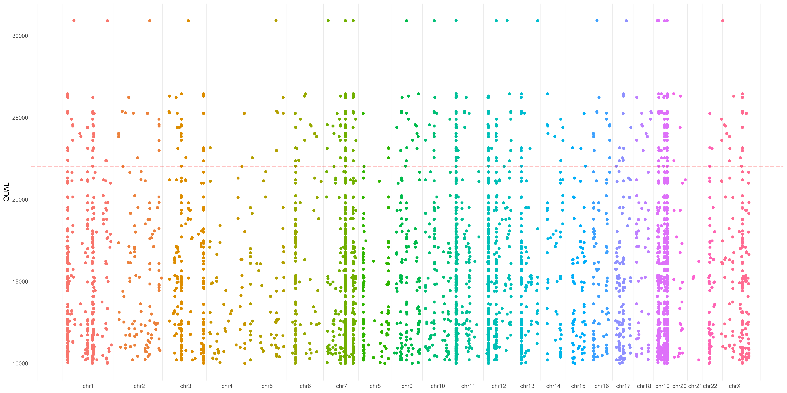
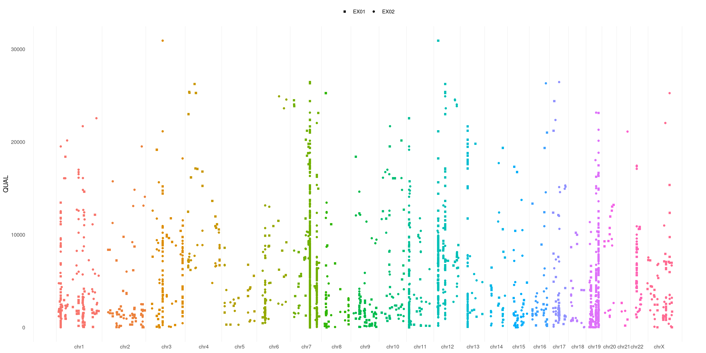
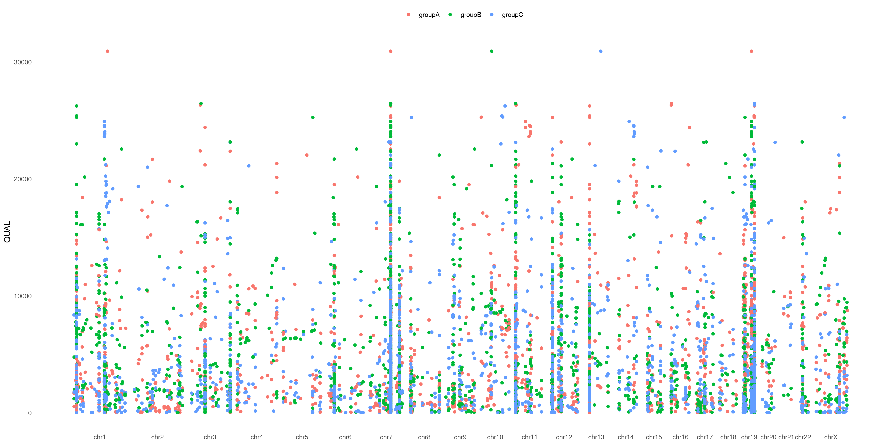

How many times you hoped to easily plot variants in yout VCF files in order to operate a fast visual analysis on them?!
It happened to me soo many times...and this is exactly why we created this R package for you! :wink:

Let's take a brief look at how it works

# Install plotVCF
Installing `plotVCF` is as simple as:
```
if (!require("devtools")) install.packages("devtools")
if (!require("BiocManager")) install.packages("BiocManager")
remotes::install_github(
    "cccnrc/plot-VCF",
    repos = BiocManager::repositories()
)
```
If you know a bit of R code (no worries, you don't really need to) you noticed that it only requires [devtools](https://devtools.r-lib.org/) and [BiocManager](https://cran.r-project.org/web/packages/BiocManager/vignettes/BiocManager.html).

The rest of dependencies you need will be installed directly with `plotVCF`: that's why installation will probably take a while (but you need to perform it only once :wink:)

# Run plotVCF
To use `plotVCF` you only need to point it to your VCF file.
Then just call the `createVCFplot()` funtion on them and you will get your Manhattan VCF plot out!

As example, if you are in the `plot-VCF` downloaded with this github repo, you can use our example VCF file:
```
library(plotVCF)

VCF <- './inst/extdata/exampleVCF.vcf.gz'

createVCFplot( VCF )
```
You can use both `.vcf` and [bgzipped](http://www.htslib.org/doc/bgzip.html) `.vcf.gz` files!

# plotVCF usage
Let's have a look on how many different things you can achieve with this package!

All plots in examples below are generated from the same VCF file, that you can find (compressed) [here](inst/extdata/exampleVCF.vcf.gz).
## basic visualization plot
The default behavior of `createVCFplot()` is to allow visualization of variants position. It will create random Y-values for variants just to allow their visualization:
```
createVCFplot( VCF )
```

## basic visualization plot - ordered
You can also choose to order your variants based on sample representation, this will allow you to graphically represent variant number differences across different chromosomes:
```
createVCFplot( VCF, ORDERED=TRUE )
```

## user-defined visualization plot
You can specify any numerical VCF variant flag (make sure you have that flag specified in your VCF header) to use as Y-axis in your plot. This creates a sort of Manhattan VCF plot, based on that value.

In this example, I used `QUAL` flag of my variants as Y-axis coordinate:
```
createVCFplot( VCF, VAR_FLAG="QUAL" )
```

This can be of great utility! Let's say you're dealing with **somatic** variants. You surely would be happy to take a look at [Variant Allele Fraction](https://www.ncbi.nlm.nih.gov/pmc/articles/PMC4850126/#__sec8title) spanned over your samples/chromosomes. This is pretty easy: just specify `AF` in the `VAR_FLAG` option:

You can use this `AF` flag when dealing with **germline** variants as well: `plotVCF()` will calculate it for you (considering Alternate Allele Read Depth / Total Read Depth, that you generally have in .vcf files)
## user-defined visualization plot - chromosome lines
You can also put a line to separate each exact chromosome border. Just use `SPACELINE` option:
```
createVCFplot( VCF, VAR_FLAG="QUAL", THRESHOLD=22000, SPACELINE=TRUE )
```

## user-defined visualization plot - threshold
You can also use a threshold that will be plotted on your Y-axis defined flag (such as you do with significance in a Manhattan plot):
```
createVCFplot( VCF, VAR_FLAG="QUAL", THRESHOLD=22000 )
```

## user-defined visualization plot - Y-axis
You can also use specify a threshold as Y-axis base. As example, in case you want to plot only positions >10000 QUAL:
```
createVCFplot( VCF, VAR_FLAG="QUAL", THRESHOLD=22000, XLIM=10000 )
```

## position focused plot
If you wish to graphically analyze just some chromosomes, you can use `CHR_NAMES` flag:
```
createVCFplot( VCF, VAR_FLAG="QUAL", CHR_NAMES=c("chr3","chr4","chr5","chr13","chr19","chrX") )
```

## sample focused plot
You can also restrict your plot to some specific sample. Just use `SAMPLE` flag.
It takes both single samples (e.g. `EX01`) and multiple samples (e.g. `c( 'EX01', 'EX02', 'EX05' )`):
```
createVCFplot( VCF, VAR_FLAG="QUAL", SAMPLE=c( 'EX01', 'EX02', 'EX05' ) )
```

## sample focused plot - differentiate
And what about if you want to differentiate each sample variant? Just use `SHAPE` option:
```
createVCFplot( VCF, VAR_FLAG="QUAL", SAMPLE=c( 'EX01', 'EX02', 'EX05' ), SHAPE=TRUE )
```

## sample focused plot - color groups
Is not that easy to separate each sample variant in the plot above. What about playing with colors to help us out?
You can pass a [list](https://www.tutorialspoint.com/r/r_lists.htm) to specify which sample pertains to which group (as example: *cases* vs. *controls*) and have different groups plotted in different colors!
Take a look at `COLOR_SAMPLE` magic option on our [example VCF](inst/extdata/exampleVCF.vcf.gz):
```
COLOR_SAMPLE <- list(
                    "groupA" = "EX01",
                    "groupB" = c( "EX02", "EX05" ),
                    "groupC" = c( "EX03", "EX04", "EX06" )
                    )

createVCFplot( VCF, VAR_FLAG="QUAL", COLOR_SAMPLE=COLOR_SAMPLE )
```

We love it! Hope you will too :wink:
## advanced plot
There are many more combinations you can create with this package, explore all possible values with:
```
?createVCFplot
```
and create your own plots!

# Save plotVCF
Once you created your plot, you can save it with any R graphic function ([png()](https://cran.r-project.org/web/packages/png/index.html),[pdf()](https://www.rdocumentation.org/packages/grDevices/versions/3.6.2/topics/pdf),[tiff()](https://stat.ethz.ch/R-manual/R-devel/library/grDevices/html/png.html), etc.).

Something I like:
```
VCF_PLOT <- createVCFplot( VCF )
PNG_FILE <- <path-to-your-PNG-output>

png( PNG_FILE,  width = 5000, height = 2500, res = 300 )
print(VCF_PLOT)
whatever <- dev.off()
```
but fell free to use what you wish!


## FASTA file
To use `plotVCF()` with a different assembly than `hg18` or `GRCh37` you need a [FASTA file](https://en.wikipedia.org/wiki/FASTA_format) to let the software know chromosome boundaries etc.

You need to use the same FASTA format on which your VCF was aligned to. If you are not sure what are we talking about you should find this information in your [VCF header](https://samtools.github.io/hts-specs/VCFv4.2.pdf). In the examples below I used a [hg38](https://www.ncbi.nlm.nih.gov/assembly/GCF_000001405.26/) aligned VCF, which is `plotVCF()` default assembly.

***Important***: make sure the chromosome names in your FASTA file exactly match chromosome names in your VCF file! (e.g. you can find VCF with `chr1` name format while FASTA may have `1` name format or reversal. Those *VCF and FASTA chromosome names must match!*)
