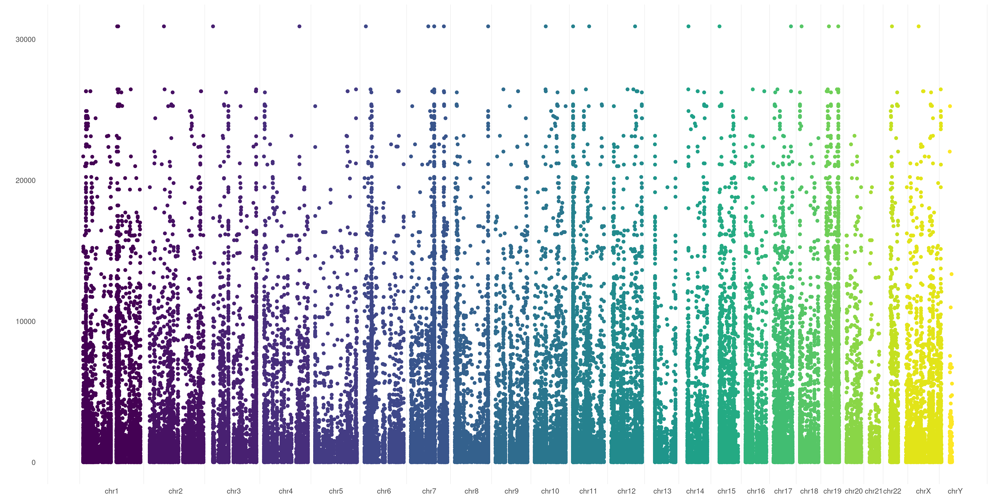

This is the repo for VCF files plot

# Install plotVCF
Installing `plotVCF` is as simple as:
```
if (!require("devtools")) install.packages("devtools")
if (!require("BiocManager")) install.packages("BiocManager")
remotes::install_github(
    "cccnrc/plot-VCF",
    repos = BiocManager::repositories()
)
```
If you know a bit of R code (no worries, you don't really need to :wink:) you noticed that it only requires [devtools](https://devtools.r-lib.org/) and [BiocManager](https://cran.r-project.org/web/packages/BiocManager/vignettes/BiocManager.html).

The rest of dependencies you need will be installed directly with `plotVCF`: that's why installation will probably take a while (but you need to perform it only once :wink:)

# Run plotVCF
To use `plotVCF` you only need to point it to a VCF and a FASTA file. Then just call the `createVCFplot()` funtion on them and you will get your Manhattan VCF plot out!
```
library(plotVCF)

VCF <- <path-to-your-VCF-file>
FASTA <- <path-to-your-FASTA-file>

createVCFplot( VCF, FASTA )
```
There are multiple options you can specify, just have a look at them with:
```
?createVCFplot
```

# plotVCF usage
Let's have a look on how many different things you can achieve with this package!

All plots in examples below are generated from the same VCF file, that you can find (compressed) [here](inst/extdata/exampleVCF.vcf.gz).
<span style="color:red">Important!</span>: you need to decompress it first!
```
gzip -d inst/extdata/exampleVCF.vcf.gz
```
## basic visualization plot
The default behavior of `plotVCF()` is to allow visualization of variants position. It will create random Y-values for variants just to allow their visualization:
```
VCF <- inst/extdata/exampleVCF.vcf.gz
FASTA <- <path-to-your-FASTA-file>

plotVCF( VCF, FASTA )
```

## basic visualization plot - ordered
You can also choose to order your variants based on sample representation, this will allow you to graphically represent variant number differences across different chromosomes:
```
plotVCF( VCF, FASTA, ORDERED=TRUE )
```

## user-defined visualization plot
This is more interesting, you can also specify any numerical VCF variant flag (make sure you have that flag in your VCF) to use as Y-axis in your plot. This creates a sort of Manhattan VCF plot, based on that value.

In this example, I used `QUAL` flag of my variants as Y-axis coordinate:
```
plotVCF( VCF, FASTA, VAR_FLAG="QUAL" )
```

## user-defined visualization plot - threshold
You can also use a threshold that will be plotted on your Y-axis defined flag (such as you do with significance in a Manhattan plot):
```
plotVCF( VCF, FASTA, VAR_FLAG="QUAL", THRESHOLD=22000 )
```


And many more combinations!


# Save plotVCF
Once you created your plot, you can save it with any R graphic function ([png()](https://cran.r-project.org/web/packages/png/index.html),[pdf()](https://www.rdocumentation.org/packages/grDevices/versions/3.6.2/topics/pdf),[tiff()](https://stat.ethz.ch/R-manual/R-devel/library/grDevices/html/png.html), etc.).

Something I like:
```
VCF_PLOT <- createVCFplot( VCF, FASTA )

png( <path-to-your-PNG-output>,  width = 5000, height = 2500, res = 300 )
VCF_PLOT
whatever <- dev.off()
```
but fell free to use what you wish!
