How many times you hoped to easily plot variants in your VCF files in order to operate a fast visual analysis on them?!
It happened to me soo many times...and this is exactly why we created this R package for you! :wink:

Let's take a brief look at how it works

# Install plotVCF
Installing `plotVCF` is as simple as:
```
if (!require("devtools")) install.packages("devtools")
if (!require("BiocManager")) install.packages("BiocManager")
remotes::install_github(
    "cccnrc/plot-VCF",
    repos = BiocManager::repositories()
)
```
If you know a bit of R code (no worries, you don't really need to) you noticed that it only requires [devtools](https://devtools.r-lib.org/) and [BiocManager](https://cran.r-project.org/web/packages/BiocManager/vignettes/BiocManager.html).

The rest of dependencies you need will be installed directly with `plotVCF`: that's why installation will probably take a while (but you need to perform it only once :wink:)

# Run plotVCF
To use `plotVCF` you only need to point it to your VCF file.
Then just call the `createVCFplot()` funtion on them and you will get your Manhattan VCF plot out!

As example, if you are in the `plot-VCF` downloaded with this github repo, you can use our example VCF file:
```
library(plotVCF)

VCF <- './inst/extdata/exampleVCF.vcf.gz'

createVCFplot( VCF )
```
You can use both `.vcf` and [bgzipped](http://www.htslib.org/doc/bgzip.html) `.vcf.gz` files!

# plotVCF usage
Let's have a look on how many different things you can achieve with this package!

First thing first: there are two main analysis (and plots) that you can run through `plotVCF()`. These are:
1. ***variant Manhattan-style plots***: visualize all/specific variants in your VCF file. You can plot subgroups based on position, sample, gene and/or exon [(createVCFplot())](#Manhattan-style-plots)
2. ***chromosome summary plots***: visualize plot of variants distribution across (selectable) chromosomes in your VCF file [(chrAnalysis())](#chromosome-summary-plots)
3. ***gene summary plots***: visualize plot of variants distribution across (selectable) genes in your VCF file [(geneAnalysis())](#gene-summary-plots)


## Manhattan-style plots
The main focus of this plots is to visualize all/specific variants in your VCF file. You can plot subgroups based on position, sample, gene and/or exon. Let's take a look at its many different options!

All plots in examples below are generated from the same VCF file, that you can find (compressed) [here](inst/extdata/exampleVCF.vcf.gz).
### basic visualization plot
The default behavior of `createVCFplot()` is to allow visualization of variants position. It will create random Y-values for variants just to allow their visualization:
```
createVCFplot( VCF )
```

### basic visualization plot - ordered
You can also choose to order your variants based on sample representation, this will allow you to graphically represent variant number differences across different chromosomes:
```
createVCFplot( VCF, ORDERED=TRUE )
```

### user-defined visualization plot
You can specify any numerical VCF variant flag (make sure you have that flag specified in your VCF header) to use as Y-axis in your plot. This creates a sort of Manhattan VCF plot, based on that value.

In this example, I used `QUAL` flag of my variants as Y-axis coordinate:
```
createVCFplot( VCF, VAR_FLAG="QUAL" )
```

This can be of great utility! Let's say you're dealing with **somatic** variants. You surely would be happy to take a look at [Variant Allele Fraction](https://www.ncbi.nlm.nih.gov/pmc/articles/PMC4850126/#__sec8title) spanned over your samples/chromosomes (to rapidly identify regions/sample with a higher burden of mutations etc.). This is pretty easy: just specify `AF` in the `VAR_FLAG` option:

You can use this `AF` flag when dealing with **germline** variants as well: `plotVCF()` will calculate it for you (considering Alternate Allele Read Depth / Total Read Depth, that you generally have in .vcf files)
### user-defined visualization plot - chromosome lines
You can also put a line to separate each exact chromosome border. Just use `SPACELINE` option:
```
createVCFplot( VCF, VAR_FLAG="QUAL", THRESHOLD=22000, SPACELINE=TRUE )
```

### user-defined visualization plot - threshold
You can also use a threshold that will be plotted on your Y-axis defined flag (such as you do with significance in a Manhattan plot):
```
createVCFplot( VCF, VAR_FLAG="QUAL", THRESHOLD=22000 )
```

### user-defined visualization plot - Y-axis
You can also use specify a threshold as Y-axis base. As example, in case you want to plot only positions >10000 QUAL:
```
createVCFplot( VCF, VAR_FLAG="QUAL", THRESHOLD=22000, XLIM=10000 )
```

### position focused plot
If you wish to graphically analyze just some chromosomes, you can use `CHR_NAMES` flag:
```
createVCFplot( VCF, VAR_FLAG="QUAL", CHR_NAMES=c("chr3","chr4","chr5","chr13","chr19","chrX") )
```
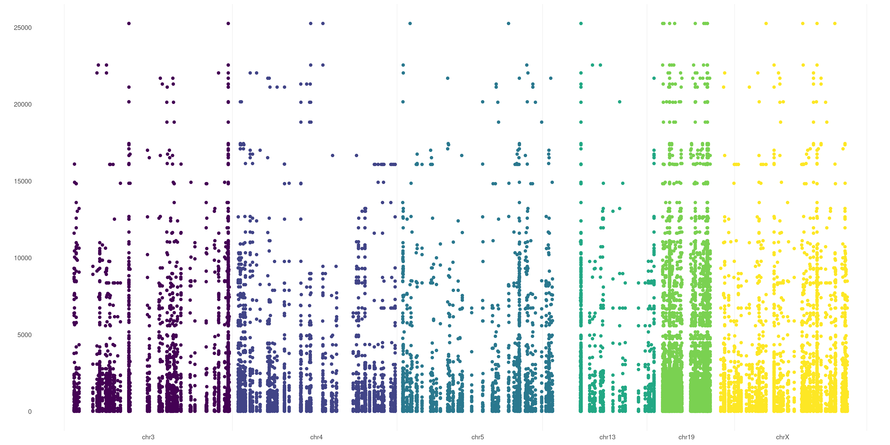
### sample focused plot
You can also restrict your plot to some specific sample. Just use `SAMPLE` flag.
It takes both single samples (e.g. `EX01`) and multiple samples (e.g. `c( 'EX01', 'EX02', 'EX05' )`):
```
createVCFplot( VCF, VAR_FLAG="QUAL", SAMPLE=c( 'EX01', 'EX02', 'EX05' ) )
```
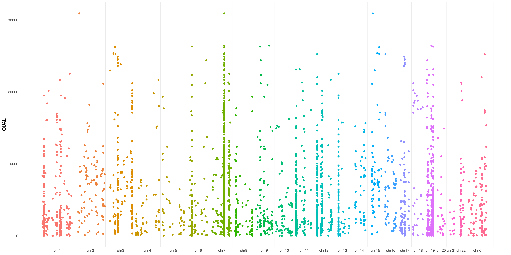
### sample focused plot - differentiate
And what about if you want to differentiate each sample variant? Just use `SHAPE` option:
```
createVCFplot( VCF, VAR_FLAG="QUAL", SAMPLE=c( 'EX01', 'EX02', 'EX05' ), SHAPE=TRUE )
```

### sample focused plot - color groups
Is not that easy to separate each sample variant in the plot above. What about playing with colors to help us out?
You can pass a [list](https://www.tutorialspoint.com/r/r_lists.htm) to specify which sample pertains to which group (as example: *cases* vs. *controls*) and have different groups plotted in different colors!
Take a look at `COLOR_SAMPLE` magic option on our [example VCF](inst/extdata/exampleVCF.vcf.gz):
```
COLOR_SAMPLE <- list(
                    "groupA" = "EX01",
                    "groupB" = c( "EX02", "EX05" ),
                    "groupC" = c( "EX03", "EX04", "EX06" )
                    )

createVCFplot( VCF, VAR_FLAG="QUAL", COLOR_SAMPLE=COLOR_SAMPLE )
```

We love it! Hope you will too :wink:
### gene(s) plot
What if I want to investigate some specific gene in my VCF file? Let's say I want to take a look at HLA genes. I can plot these just variants relying in those genes just adding `GENE` option:
```
createVCFplot( VCF, VAR_FLAG="QUAL", GENE=c('HLA-DRB5', 'HLA-DRB1','HLA-DQA1','HLA-DQB1','HLA-DQB2', 'HLA-DQB2'), COLOR_SAMPLE=COLOR_SAMPLE )
```
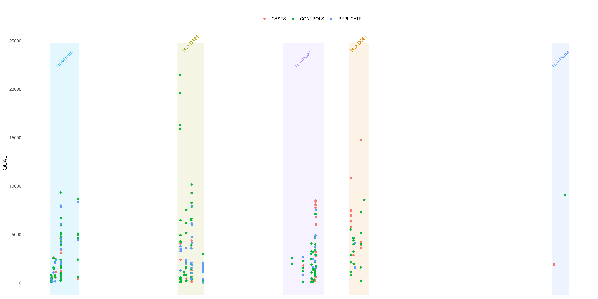
### exon(s) plot
Sometimes you want to deepen even more your analysis inside some specific gene. As in the example above, I see that many of my variants falls into HLA-DQB1 gene. I can investigate which exon each of them pertains to with `EXON` option:
```
createVCFplot( VCF, VAR_FLAG="QUAL", COLOR_SAMPLE=COLOR_SAMPLE, GENE='HLA-DQB1', EXON=TRUE )
```
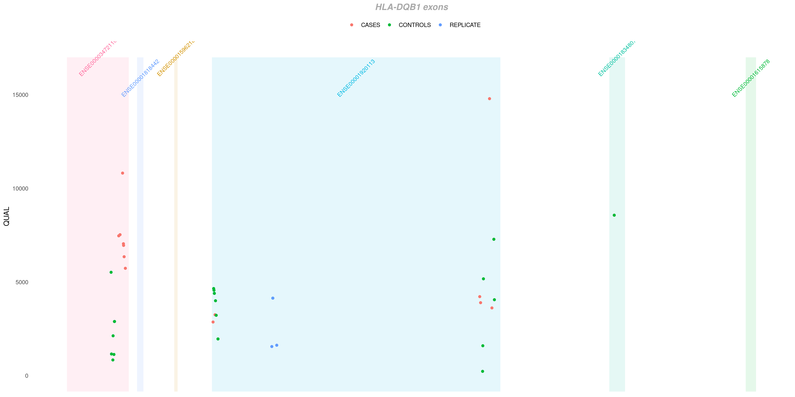

## chromosome summary plots
Let's perform an analysis about variant distribution across different chromosomes in your VCF file.

`chrAnalysis()` function returns both plots `chrAnalysis( VCF )$PLOT` and summary tables `chrAnalysis( VCF )$TAB`: take a look at them: you have both single-sample (`$SAMPLE`), grouped (`$GROUP`) and overall (`$SUM`) tables and plots! `chrAnalysis()` plots a merged plot with all the others plots in it: `geneAnalysis( VCF )$PLOT$MERGED`

Let's have a look at the chromosome summary plots
```
chrAnalysis( VCF )$PLOT$MERGED
```
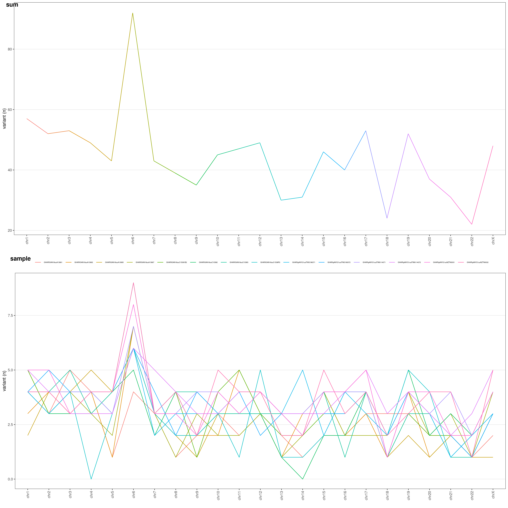
You can choose the Y-axis values through `METHOD` option:
- `RAW`: raw number of variants
- `LEN`: number of variants / chromosome length (ratio: each chromosome length is divided by the median chromosome length)
- `COD`: number of variants / chromosome coding regions overall length (ratio)
- `LENCOD`: number of variants / chromosome length (ratio) * chromosome coding regions overall length (ratio)

These different options allow you to normalize your variants and identify which chromosomes underwent a higher mutation rate:
```
chrAnalysis( VCF, METHOD = "LENCOD" )$PLOT$MERGED
```
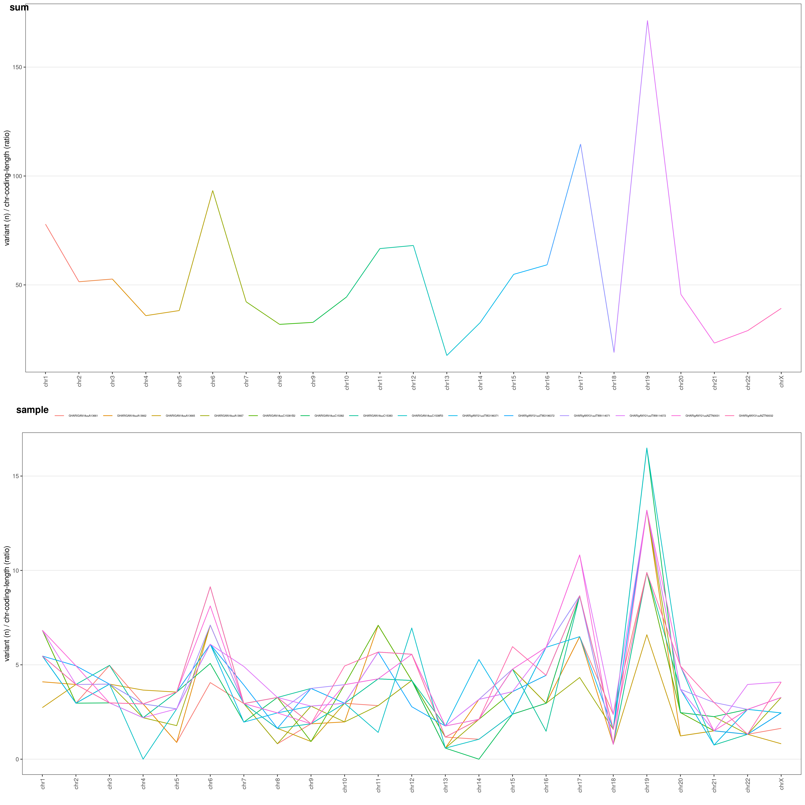

You might be very interested in visualize difference for grouped samples (e.g. cases vs. controls). Just add `COLOR_SAMPLE` option (same `list()` object explained [above](#sample-focused-plot---color-groups):
```
chrAnalysis( VCF_FILE, COLOR_SAMPLE = COLOR_SAMPLE, METHOD = "LENCOD" )$PLOT$MERGED
```
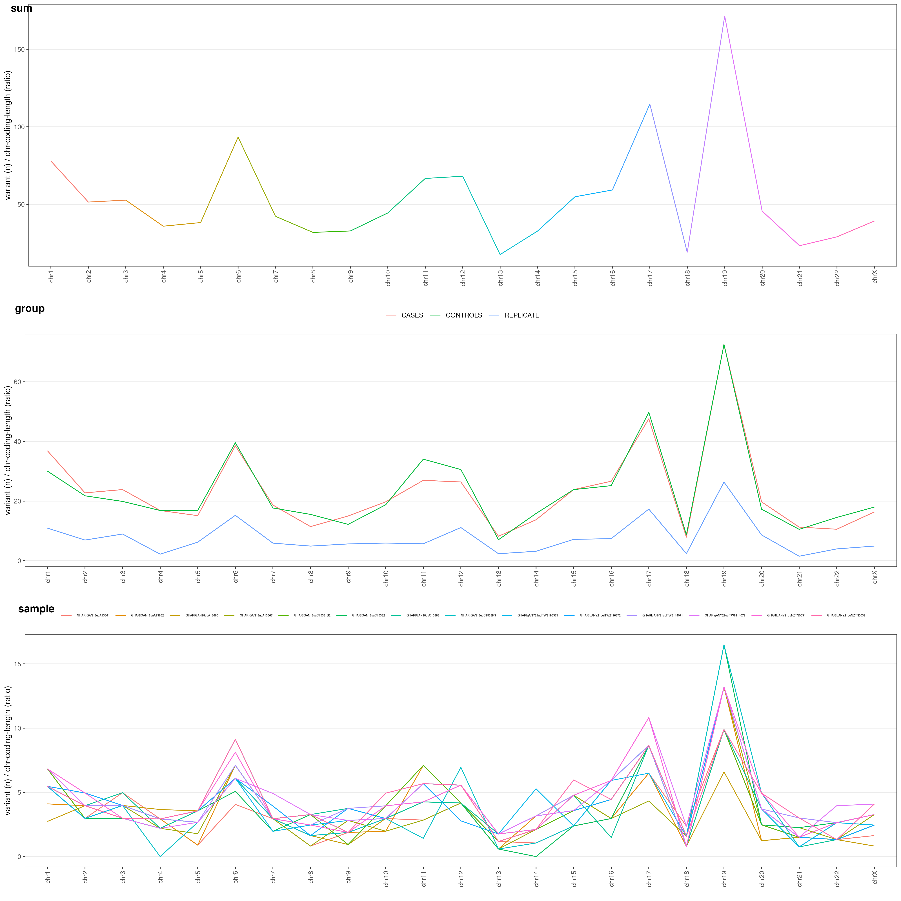

You can also divide your plot based on variant type: [SNV](https://en.wikipedia.org/wiki/Single-nucleotide_polymorphism) vs. [INDEL](https://en.wikipedia.org/wiki/Indel). Just add `TYPE` option to `chrAnalysis()`:
```
chrAnalysis( VCF_FILE, COLOR_SAMPLE = COLOR_SAMPLE, METHOD = "LENCOD", TYPE = TRUE )$PLOT$MERGED
```
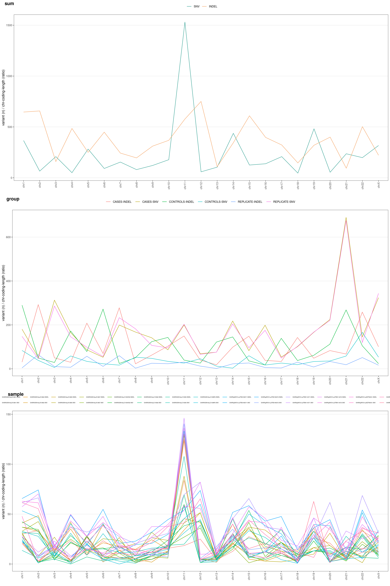


## gene summary plots
This is the function to use if you want to perform an analysis about variant distribution across different genes in your VCF file.

This function returns both plots `geneAnalysis( VCF )$PLOT` and summary tables `geneAnalysis( VCF )$TAB`: take a look at them: you have both single-sample (`$SAMPLE`), grouped (`$GROUP`) and overall (`$SUM`) tables and plots! `geneAnalysis( VCF )` plots a merged plot with all the others plots in it: `geneAnalysis( VCF )$PLOT$MERGED`

Let's say you want to know on which genes most of your variants are. You can easily plot this through `geneAnalysis()` function. It will plot for you each gene number of variants, both summarized over all samples (above) and for each single sample (below):
```
geneAnalysis( VCF )$PLOT$MERGED
```
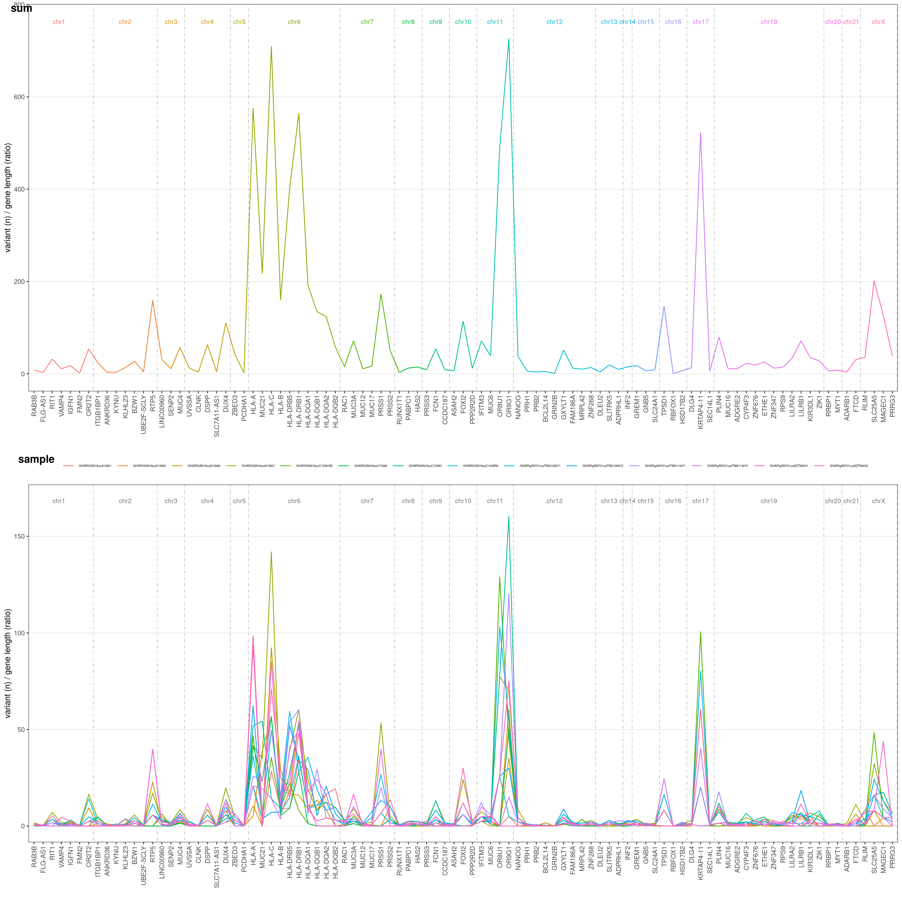
The Y-axis values are the number of variants for each gene in your VCF file, divided by a gene-length ratio to correct for gene length. This ratio is obtained dividing each gene length by the mean human gene length (which is ~24kbp). Thus, if all gene would suffer the same mutation rate, they would all have the same ratio in this plot!

Default threshold for genes to be plotted is 90° centile. Only genes with an overall number of variants >90° centile (based on your VCF data) are shown. You can freely choose this threshold with `CENTILE` option. Let's say we want to restrict the analysis to >95° centile:
```
geneAnalysis( VCF, CENTILE = 0.95 )$PLOT$MERGED
```
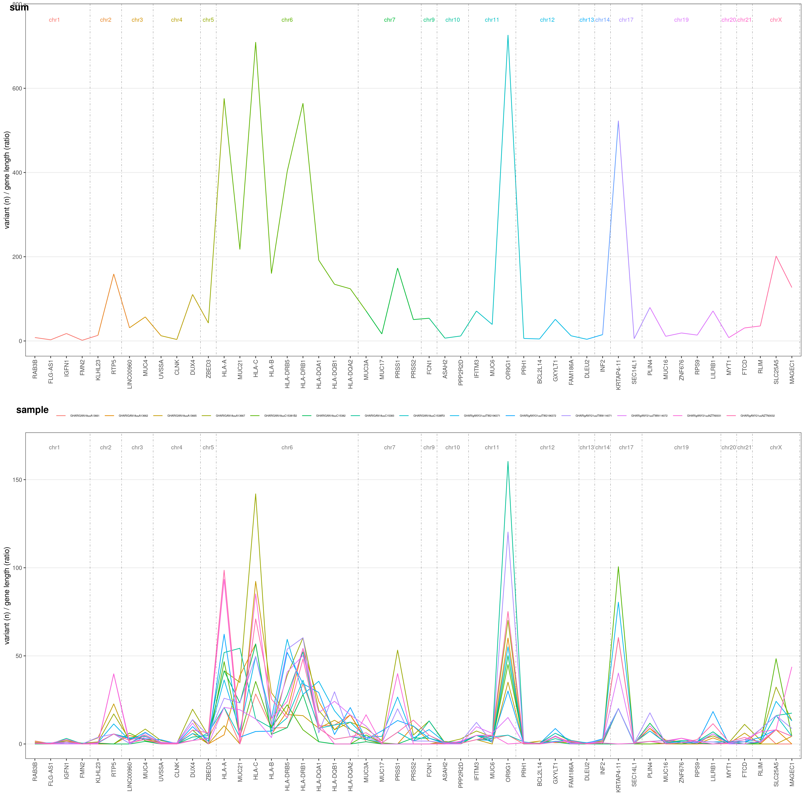

You might be very interested in visualize difference in mutation rate for each gene and samples grouped (e.g. cases vs. controls). Just add `COLOR_SAMPLE` option (same `list()` object explained [above](#sample-focused-plot---color-groups):
```
geneAnalysis( VCF_FILE, COLOR_SAMPLE = COLOR_SAMPLE, CENTILE = 0.95 )$PLOT$MERGED
```
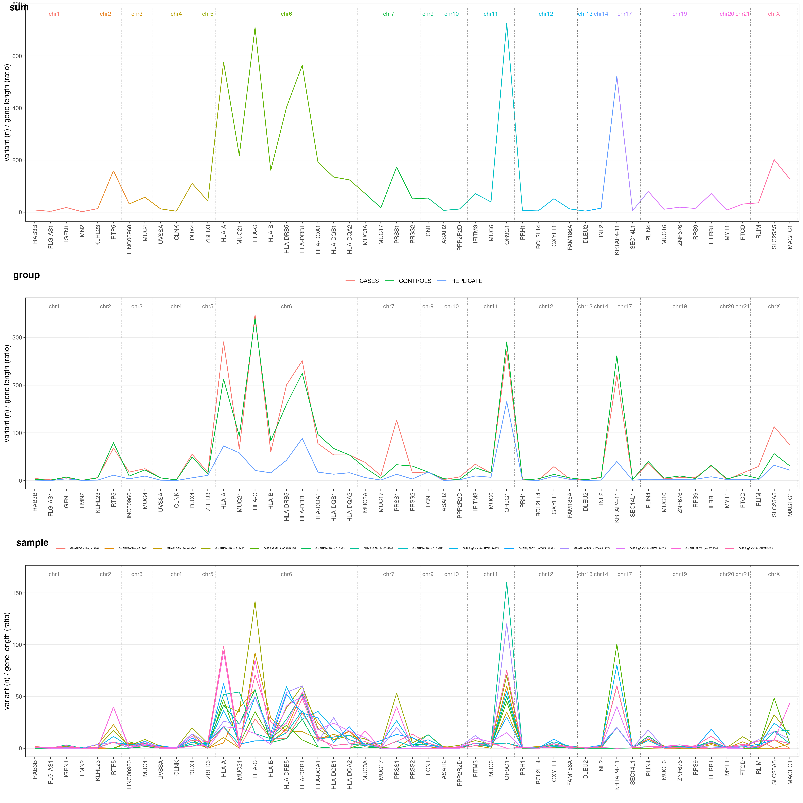

## advanced plot
There are many more combinations you can create with this package, explore all possible values with:
```
?createVCFplot
?geneAnalysis
```
and create your own plots!

# Save plotVCF
Once you created your plot, you can save it with any R graphic function ([png()](https://cran.r-project.org/web/packages/png/index.html),[pdf()](https://www.rdocumentation.org/packages/grDevices/versions/3.6.2/topics/pdf),[tiff()](https://stat.ethz.ch/R-manual/R-devel/library/grDevices/html/png.html), etc.).

Something I like:
```
VCF_PLOT <- createVCFplot( VCF )
PNG_FILE <- <path-to-your-PNG-output>

png( PNG_FILE,  width = 5000, height = 2500, res = 300 )
print(VCF_PLOT)
whatever <- dev.off()
```
but fell free to use what you wish!


## FASTA file
To use `plotVCF()` with a different assembly than `hg18` or `GRCh37` you need a [FASTA file](https://en.wikipedia.org/wiki/FASTA_format) to let the software know chromosome boundaries etc.

You need to use the same FASTA format on which your VCF was aligned to. If you are not sure what are we talking about you should find this information in your [VCF header](https://samtools.github.io/hts-specs/VCFv4.2.pdf). In the examples below I used a [hg38](https://www.ncbi.nlm.nih.gov/assembly/GCF_000001405.26/) aligned VCF, which is `plotVCF()` default assembly.

***Important***: make sure the chromosome names in your FASTA file exactly match chromosome names in your VCF file! (e.g. you can find VCF with `chr1` name format while FASTA may have `1` name format or reversal. Those *VCF and FASTA chromosome names must match!*)
